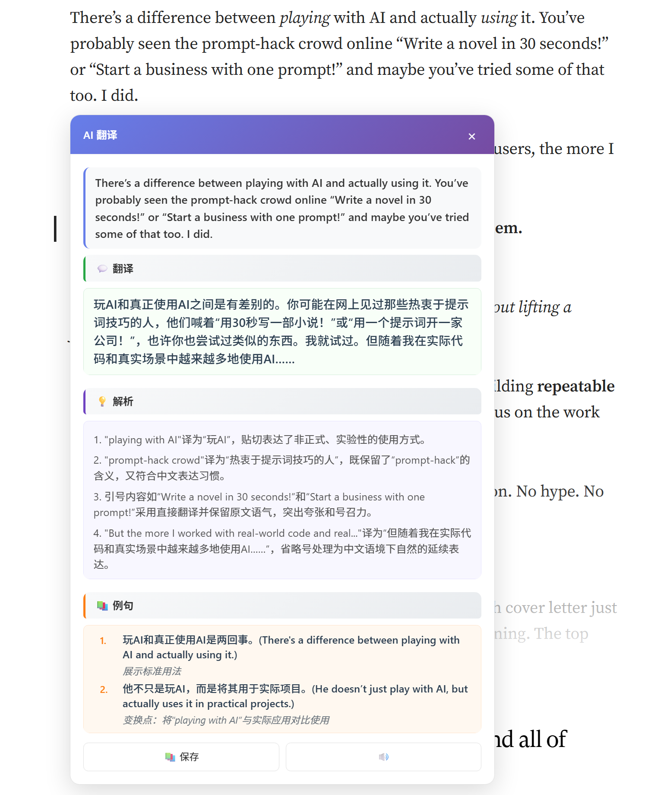

# LexiMemo AI Chrome Extension

一款基于 AI 和艾宾浩斯记忆曲线的智能语言学习 Chrome 插件。

## 🌟 功能特点

- **AI 驱动翻译**: 支持 OpenAI、DeepSeek、Google Gemini、Qwen 多种 AI 模型
- **流式翻译**: 实时流式显示翻译结果，提升用户体验(暂时不支持)
- **智能记忆系统**: 基于艾宾浩斯记忆曲线的 SM-2 算法
- **划词翻译**: 在任何网页上选择文本即可获得翻译
- **复习提醒**: 智能安排复习计划，每日复习通知
- **数据同步**: Firebase 云同步 + 本地存储双重保障
- **离线支持**: 本地优先模式，支持离线使用
- **匿名登录**: 无需注册，自动匿名登录保护隐私

## 🚀 快速开始

### 安装依赖

```bash
npm install
```

### 开发模式

```bash
npm run dev
```

### 构建插件

```bash
npm run build
```

### 加载到 Chrome

1. 运行 `npm run build` 构建插件
2. 打开 Chrome 浏览器，进入 `chrome://extensions/`
3. 开启"开发者模式"
4. 点击"加载已解压的扩展程序"
5. 选择项目根目录的编译产物目录dist

## 📁 项目结构

```
src/
├── background/          # Service Worker (Manifest V3)
│   └── index.ts        # 核心后台服务，处理 AI 调用和数据同步
├── content/            # Content Script
│   ├── index.ts        # 划词翻译功能
│   └── styles.css      # 翻译卡片样式
├── popup/              # 插件主界面 (React 应用)
│   ├── components/     # 可复用组件
│   ├── pages/         # 页面组件 (Home, Review, Settings)
│   ├── App.tsx        # 主应用组件
│   ├── main.tsx       # React 入口
│   └── index.html     # HTML 模板
├── services/          # 核心服务层
│   ├── aiService.ts   # AI 适配器，支持多种模型
│   ├── firebaseService.ts  # Firebase 云同步服务
│   ├── storageService.ts   # 本地存储服务
│   ├── reviewEngine.ts     # SM-2 复习算法
│   └── messageService.ts   # 消息通信服务
├── stores/            # 状态管理
│   ├── appStore.ts    # 全局应用状态 (Zustand)
│   └── uiStore.ts     # UI 状态管理
├── types/             # TypeScript 类型定义
│   └── index.ts       # 核心数据类型
└── vite-env.d.ts      # Vite 环境变量类型
```

## 🔧 技术栈

- **前端**: React 18 + TypeScript 5.2+ + Vite 5.0
- **UI 库**: Material-UI (MUI) 5.14+ with Emotion
- **状态管理**: Zustand 4.4+ + TanStack Query 5.8+
- **AI 服务**: OpenAI / DeepSeek / Google Gemini / Qwen (通义千问)
- **后端**: Firebase 10.7+ (Authentication + Firestore)
- **存储**: Chrome Storage API (本地优先模式)
- **构建工具**: Vite (ES 模块，Manifest V3 兼容)
- **代码质量**: ESLint + Prettier + TypeScript 严格模式

## 📖 使用说明

### 1. 配置 AI 服务

1. 点击插件图标打开主界面
2. 进入"Settings"页面
3. 选择 AI 提供商并输入 API Key
   - 支持 OpenAI、DeepSeek、Google Gemini、Qwen
4. 点击"Validate & Save"验证并保存

### 2. 开始学习

1. 在任何网页上选择要学习的文本（单词或句子）
2. 等待流式翻译结果实时显示(暂时不支持)
3. 在翻译卡片中查看详细解释、发音、例句
4. 点击"Save to Memory"保存到学习库



*翻译插件运行时的界面效果，展示了划词翻译的交互体验*

### 3. 复习单词

1. 在主页查看待复习的单词数量和学习进度
2. 点击"Start Review"开始复习
3. 根据记忆情况选择难度评级：
   - 🟢 Easy: 记得很清楚
   - 🟡 Good: 有点印象
   - 🔴 Hard: 完全忘记

### 4. 数据同步

- **自动同步**: 插件会自动进行 Firebase 云同步
- **离线使用**: 支持离线模式，数据优先存储在本地
- **匿名登录**: 无需注册，自动匿名登录保护隐私
- **多设备**: 在不同设备间无缝同步学习进度

## 🔑 API Key 获取

- **OpenAI**: https://platform.openai.com/api-keys
- **DeepSeek**: https://platform.deepseek.com/api-keys  
- **Google Gemini**: https://makersuite.google.com/app/apikey
- **Qwen (通义千问)**: https://dashscope.aliyuncs.com/

## 🛠️ 开发指南

### 项目架构

- **本地优先模式**: 数据优先存储在本地，后台自动同步到 Firebase
- **流式翻译**: 支持实时流式显示翻译结果，提升用户体验(暂时不支持)
- **适配器模式**: 统一处理不同 AI 提供商的 API 调用
- **Service Worker**: 使用 Manifest V3，所有 API 调用在后台处理

### 添加新的 AI 提供商

1. 在 `src/services/aiService.ts` 中的 `AI_PROVIDERS` 对象添加新配置
2. 实现 `requestFormatter` 和 `responseParser` 函数
3. 在 `src/popup/pages/SettingsPage.tsx` 中添加新选项
4. 更新类型定义中的 `aiProvider` 联合类型

### 自定义复习算法

修改 `src/services/reviewEngine.ts` 中的 `updateItemAfterReview` 函数来调整 SM-2 算法参数：
- `easeFactor`: 记忆因子调整
- `interval`: 复习间隔计算
- `quality`: 质量评分映射

### Firebase 配置

1. 在项目根目录创建 `.env` 文件
2. 添加 Firebase 配置变量：
   ```
   VITE_FIREBASE_API_KEY=your_api_key
   VITE_FIREBASE_AUTH_DOMAIN=your_project.firebaseapp.com
   VITE_FIREBASE_PROJECT_ID=your_project_id
   VITE_FIREBASE_STORAGE_BUCKET=your_project.appspot.com
   VITE_FIREBASE_MESSAGING_SENDER_ID=123456789
   VITE_FIREBASE_APP_ID=your_app_id
   ```

### 调试技巧

- **Content Script**: 在网页控制台查看翻译相关日志
- **Background Script**: 在 `chrome://extensions/` 中点击"Service Worker"查看后台日志
- **Popup**: 右键插件图标选择"检查弹出式窗口"
- **Storage**: 使用 `chrome://extensions/` 中的存储查看器

## 📝 开发进度

### ✅ 已完成功能

- [x] **基础架构**: Vite + React + TypeScript + Manifest V3
- [x] **AI 翻译服务**: 支持 OpenAI、DeepSeek、Gemini、Qwen 四种模型
- [x] **流式翻译**: 实时流式显示翻译结果(暂时不支持)
- [x] **划词翻译**: Content Script 实现网页文本选择翻译
- [x] **本地存储**: Chrome Storage API 数据持久化
- [x] **复习系统**: SM-2 算法实现艾宾浩斯记忆曲线
- [x] **Firebase 集成**: 用户认证和数据云同步
- [x] **本地优先模式**: 离线支持，数据本地缓存
- [x] **每日复习提醒**: Chrome Alarms API 实现定时通知
- [x] **状态管理**: Zustand + TanStack Query 数据管理
- [x] **UI 界面**: Material-UI 响应式设计

### 🔄 进行中功能

- [ ] **用户体验优化**: 翻译卡片交互改进
- [ ] **错误处理**: 完善全局错误捕获和用户提示
- [ ] **性能优化**: 大量数据时的渲染性能优化

### 📋 计划中功能

- [ ] **导入/导出**: 支持单词本批量导入导出
- [ ] **学习统计**: 详细的学习进度图表和分析
- [ ] **多语言支持**: 界面多语言国际化
- [ ] **主题定制**: 更多主题选项和个性化设置
- [ ] **社交功能**: 学习成就系统和进度分享
- [ ] **更多 AI 模型**: 支持更多 AI 提供商
- [ ] **移动端适配**: PWA 版本支持移动设备

## 🤝 贡献

欢迎提交 Issue 和 Pull Request！

## 📄 许可证

MIT License